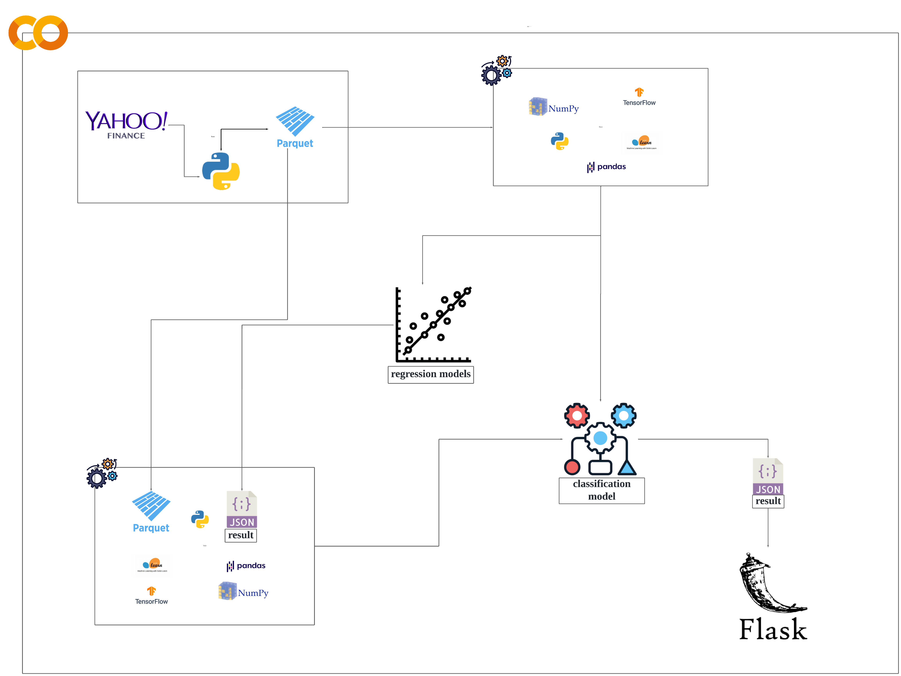

# EUR/USD Stock Prediction Project

This project predicts daily actions for the EUR/USD stock market using deep learning models. It includes API integration, model training, and a web interface with Flask for visualization.

## Project Overview
- **Languages:** Python, Jupyter (for Colab)
- **Tools/Technologies:** Flask, Colab, Google Drive, Deep Learning models

## Requirements
1. Google Drive account linked to Google Colab.
2. Python 3.x installed locally for running the Flask app.
3. Colab access for running Jupyter notebooks.

## Setup Instructions
### Step 1: Clone the Project
... (add cloning instructions)

### Step 2: Access the Project on Google Colab
... (add Colab instructions)

### Step 3: Download the Trained Project Directory
... (add download instructions)

### Step 4: Run the Flask Application
... (add Flask instructions)

## Project Architecture

### Overview
The architecture diagram illustrates the workflow of the EUR/USD stock prediction project. Here’s a breakdown of the components:
1. **Data Source**: Data is fetched from Yahoo Finance.
2. **Data Processing**: The data is converted into Parquet format for efficient storage and processing.
3. **Model Training**:
   - **Regression Models**: These models analyze historical data to predict stock trends.
   - **Classification Model**: This model classifies the predicted actions (Buy/Sell).
4. **Results**: The predictions are saved in JSON format for easy access.
5. **Web Interface**: A Flask application presents the predictions to users.

## Future Improvements
- Automate the retraining process using Airflow and Docker.
- Deploy the app via a cloud provider (e.g., Heroku, AWS).
